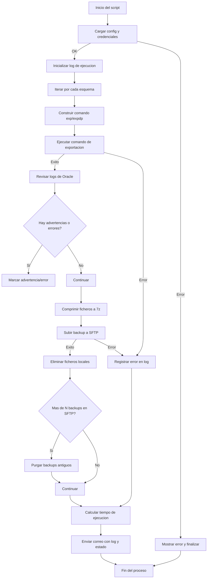

# Oracle Backup Automation

Este proyecto es un **script en Python** para automatizar la exportación de esquemas de bases de datos Oracle usando `expdp` (Data Pump), comprimir los resultados en un archivo 7z, subirlos a un servidor remoto mediante SFTP y enviar un correo con el registro del proceso.

El objetivo es **simplificar las copias de seguridad automatizadas** de Oracle y su gestión remota.

---

## Características

- Exporta esquemas de Oracle usando `expdp` o `exp`.
- Genera logs detallados de la operación.
- Comprensión de archivos `.dmp` y logs en un archivo `.7z`.
- Protección opcional del archivo comprimido con contraseña.
- Transferencia automática a un servidor SFTP remoto.
- Limpieza de archivos antiguos tanto localmente como en el servidor remoto.
- Notificación por correo electrónico con resultados del backup, incluyendo advertencias o errores.
- Configurable mediante archivos JSON externos.

---

## Requisitos

- Python 3.8+
- Cliente Oracle (`expdp` o `exp`) configurado y accesible en PATH.
- 7-Zip instalado y accesible en PATH.
- cx_oracle (para realizar consultas ORACLE)
- Librerías Python requeridas (instalables vía `pip`):

```bash
pip install paramiko py7zr cx_oracle
```

## Estructura de proyecto
```
project/
│
├─ main.py                 # Script principal de ejecución
├─ config/
│  ├─ config.json          # Configuración general del backup
│  └─ credenciales.json    # Credenciales para BBDD, SFTP y correo
├─ log/                    # Carpeta donde se generan los logs
└─ lib/                    # Librerías internas del proyecto
   ├─ lug_ficheros.py
   ├─ lug_log.py
   ├─ lug_exe.py
   ├─ lug_zip.py
   ├─ lug_sftp.py
   ├─ lug_correo.py
   └─ lug_bbdd.py
```

## Configuración

### config.json

```
{
    "FicheroCredenciales" : "config/credenciales.json",    
    "SQLRutaBackup" : "SELECT DIRECTORY_PATH FROM dba_directories WHERE DIRECTORY_NAME = 'DATA_PUMP_DIR';",
    "FraseAdvertencias" : "advertencias",
    "FraseError" : "no ha terminado correctamente",
    "Backup" :[ 
        {
            "Comando" : "expdp",
            "Esquema" : "ESQUEMA_BBDD",
            "Password" : "ContraseñaCifrado", 
            "FicheroBackup" : "backups/%%ESQUEMA%%-%%FECHA%%.dmp",
            "FicheroLog" : "backups/%%ESQUEMA%%-%%FECHA%%.log",
            "FicheroComprimido" : "%%ESQUEMA%%-%%FECHA%%.7z"    
        }
    ],
    "ConfiguracionSFTP" : {
        "RutaInicialSFTP" : "/RUTA_RELATIVA_REMOTA",
        "RutaSFTP" : "BackupTraza",
        "NumeroBackupsaMantener" : 5
    },
    "AvisoCorreo" : {
        "Destinatario" : "it@dominio.com",
        "Asunto" : "Proceso de backup del servidor %%SERVIDOR%% de la base de datos %%BBDD%%",
        "Mensaje" : "<p>Revisar log y ruta del proceso de backup con estos datos.</p>"
    }
}
```

### credenciales.json
```
{
    "BBDD" : [
        "SERVIDOR_BBDD",
        1521,
        "BBDD(SID)",
        "USER_BBDD",
        "PASS_USER_BBDD"
    ],
   
    "CORREO" : [
        "usuario_envio@dominio.com",
        "smtp.serviciodecorreo.es",
        465,
        "usuario_envio@dominio.com",
        "PASSUserCorreo"
    ],
    "SFTP" : [
        "servidor_sftp",
        2222,
        "user_SFTP",
        "pass_sftp",
        "",
        ""    
    ]
}
```
## Uso

Ejecutar el script principal:

```
python main.py
```

El script realizará los siguientes pasos automáticamente:

* Lee la configuración y credenciales.
* Ejecuta expdp para cada esquema definido (revisar config.json).
* Verifica errores y advertencias en los logs generados.
* Comprime los resultados en un archivo .7z (con o sin contraseña).
* Sube el archivo al servidor SFTP.
* Purga archivos antiguos en SFTP y localmente según configuración.
* Envía un correo con el log y los detalles del backup.

## Logs

Los logs se generan en la carpeta log/ con un timestamp en el nombre:

```
log/20250922123045001.log

```

Cada log incluye:

* Comando ejecutado
* Resultado del backup
* Tiempo total de ejecución
* Advertencias o errores encontrados

## Automatizar

Se debe de crear una tarea programada para ejecutar este programa.

Observar que si ejecutamos expdp necesitamos tener acceso a la carpeta donde guarda el backup Oracle para poder enviarlo a remoto.

Si no se puede ejecutar expdp porque el servidor no expone esa carpeta se pued ejecutar exp

Lo normal es ejecutarlo en la máquina servidor, así garantizamos que este programa tenga acceso al fichero que se genere.

## Flujo



---

🔎 Este diagrama refleja:  
- Los **puntos de decisión** (configuración válida, advertencias, errores, número de backups).  
- El **flujo principal**: configuración → backup → log → compresión → SFTP → limpieza → correo.  
- Los **flujos de error/advertencia** integrados en el proceso.  

---

